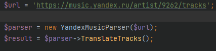
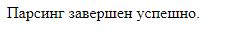
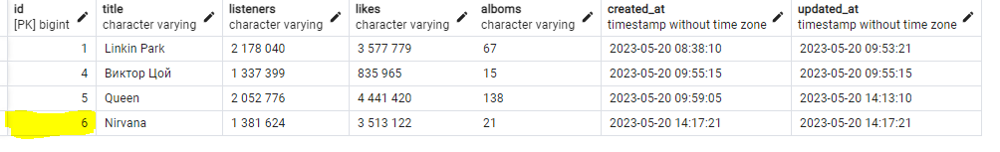
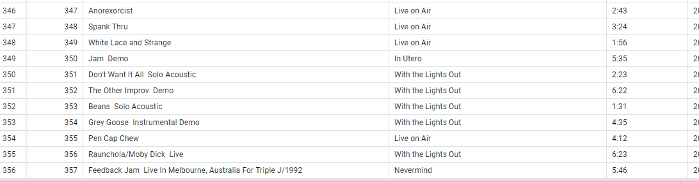

# Установка

Cоберите образы контейнеров и запустите их с помощью следующей команды:

`docker-compose up --build -d`

 Убедитесь, что контейнеры успешно запущены, выполнив команду:

`docker ps`

 Теперь вы можете зайти в контейнер app и установить зависимости Laravel и выполнить миграции с помощью команд:
 
`docker exec -it my_laravel_app bash
composer install`
`docker exec -it my_laravel_app bash
php artisan migrate`

Ваше Laravel приложение теперь должно быть доступно по адресу http://localhost:8081/. 

# Использование
В контроллере `Http/Controllers/HomeController.php` в  методе `index` изменяем переменную $url по вашему усмотрению в формате "https://music.yandex.ru/artist/79215/tracks".

Открываем ссылку http://localhost:8081/ парсинг автоматически запустится.

Для просмотра записей переходим в pgadmin - http://localhost:5050/ выполняем конект к базе данных и смотрим таблицы "Yandex_Artists" и "YandexArtists_Tracks"
# Пример использования
Берем url треков артиста, допустим: https://music.yandex.ru/artist/9262/tracks
подставляем в $url 

Далее заходим на страницу http://localhost:8081/, если нет ошибок видим следующее:

После, для проверки данных заходим на страницу   http://localhost:5050/
По стандарту логин - admin@pgadmin.com пароль - 123
Таблица артистов:

Таблица треков:

